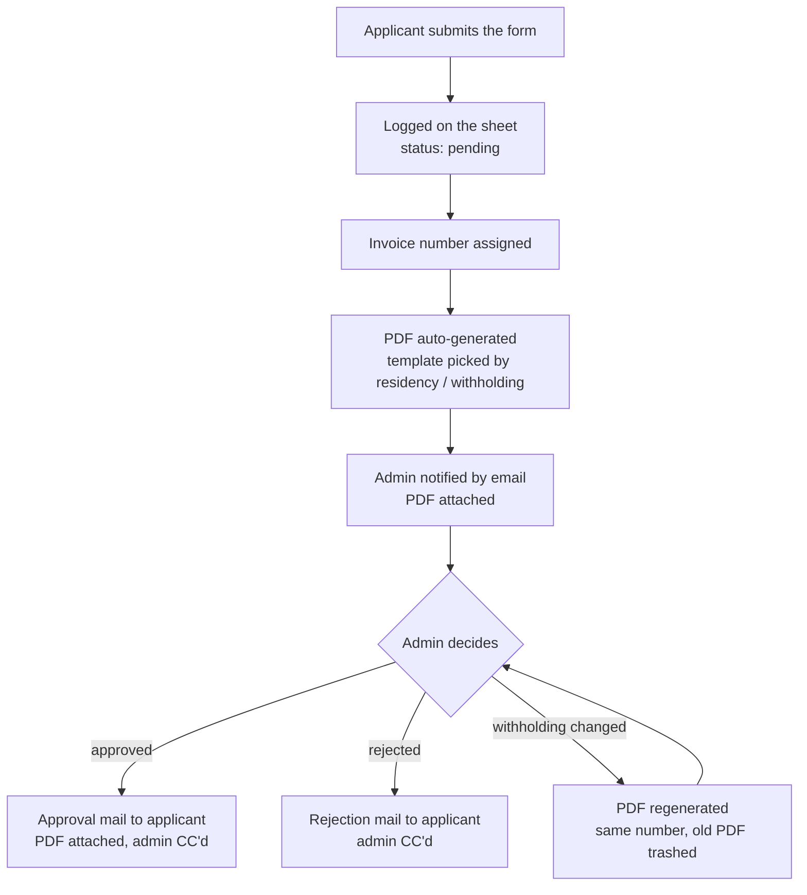

# seikyusho

> **Invoice automation for Japanese-style billing — on nothing but Google Workspace.** Accepts invoice requests through a multilingual form, auto-generates PDF invoices (Qualified Invoice System and 源泉 withholding aware), and runs the approve/reject notification flow. No server, no SaaS, no database — one MIT-licensed Apps Script project. *seikyusho（請求書）is Japanese for "invoice."*

[](https://opensource.org/licenses/MIT)
[](https://script.google.com/)
[](#)

🌐 [日本語](https://cver.net/ja-jp/oss/seikyusho) · [한국어](https://cver.net/ko-kr/oss/seikyusho) · [繁體中文](https://cver.net/zh-tw/oss/seikyusho)

---

## Overview

A fully automated invoice issuance system for accepting requests from contractors, freelancers, or any external party.

- **Applicants** simply fill out a multilingual form (Japanese / English / Traditional Chinese / Spanish)
- **Administrators** receive an email, then click "Approve" or "Reject" on the sheet
- **PDF generation, numbering, tax calculation, email notifications, and Drive archiving** are all automatic

Built entirely on Google Workspace — no external services, servers, or databases required.

## Features

- 🌐 **Multilingual form** (Japanese / English / Traditional Chinese / Spanish, switchable via URL param)
- 📄 **3 PDF templates auto-selected** (overseas resident / Japan w/o withholding / Japan with withholding)
- 🔢 **Monthly sequential invoice numbering** (e.g., `202605-001`)
- 💴 **Multi-currency** (JPY / TWD / USD / EUR, extensible)
- 🧮 **Automatic tax calculation** (10% consumption tax, 10.21% / 20.42% withholding tax with 1M JPY threshold)
- 📧 **3 types of automated emails**:
  - On submission → admin receives notification with PDF attached
  - On approval → applicant receives approval notice (PDF attached, admin CC'd)
  - On rejection → applicant receives rejection notice (admin CC'd)
- ✏️ **Email content editable from sheet** ({{INVOICE_NO}} / {{APPLICANT_NAME}} placeholders supported)
- 🧾 **Japanese Qualified Invoice System (Invoice Seido) support** (toggle registration number display)
- 🔁 **Withholding tax can be added post-submission** (changing the sheet auto-regenerates the PDF)
- 📂 **PDFs auto-saved to a Drive folder** (easy bulk sharing with accountants)

## File Structure

| File | Purpose |
|---|---|
| `appsscript.json` | Apps Script manifest (permissions, timezone) |
| `Setup.gs` | Initial setup, migrations, usage sheet generation |
| `Code.gs` | Form handler, PDF generation, mail sender, triggers |
| `index.html` | Applicant-facing web form |
| `style.html` | Form CSS (responsive) |
| `script.html` | Form JavaScript |
| `i18n.html` | Translation dictionary (日本語 / English / 繁體中文 / Español) |

## Prerequisites

- Google account (personal or Workspace)
- A browser (for the admin who sets it up)
- At least one email address to receive notifications

## Setup

Three ways to deploy. **The easiest is to copy.** Prefer to install from the GitHub source — e.g. company policy or you'd rather not copy a third party's Sheet? Use the manual or clasp path instead. Either way, your data, PDFs and emails stay entirely inside **your** account.

<details open>
<summary><b>🚀 Option A: Make a copy of the Google Sheet (easiest, ~1 min)</b></summary>

1. Open **[Make a copy of the Google Sheet](https://docs.google.com/spreadsheets/d/1kC6MI_DSrO3qaUD2kHs6oMMC54ImbMfsH-gPcduOy3w/copy)** and click "Make a copy" — the whole system lands in your own Drive.
2. Open your copy, then run the menu **"請求書 → 🚀 初期セットアップ（最初に1回）"** → authorize (Drive / Sheet / Mail / Trigger).
3. Fill company info + notification email in the **設定** (Settings) sheet.
4. **Deploy → New deployment → Web app** (Execute as: me / Access: anyone) → paste the `/exec` URL into `form_url` in Settings, then re-run `populateUsageSheet`.
5. Share the form URL with applicants.

> 🔒 The copied code is the same MIT-licensed code as on [GitHub](https://github.com/CVERInc/seikyusho) — no third-party server is involved.

</details>

<details>
<summary><b>📦 Option B: Manual copy/paste from the GitHub source (~20 min)</b></summary>

#### Step 1. Create Apps Script project

1. Open [Google Apps Script](https://script.google.com/)
2. Click "**New project**"
3. Rename it (e.g., "Invoice System")

#### Step 2. Copy 7 files

Copy each file from this repo into the Apps Script editor (1:1):

| Local | Apps Script |
|---|---|
| `appsscript.json` | `appsscript.json` (enable "Show appsscript.json" in settings) |
| `Setup.gs` | New file "Setup" |
| `Code.gs` | Overwrite the default `Code.gs` |
| `index.html` | New HTML file "index" |
| `style.html` | New HTML file "style" |
| `script.html` | New HTML file "script" |
| `i18n.html` | New HTML file "i18n" |

#### Step 3. Run initial setup (one function does it all)

> 💡 **Recommended:** Select **`setup`** from the function dropdown → **Run**. It runs everything in this step (create sheet, wire triggers, generate the usage sheet) **in the right order**, idempotently. Grant permissions on first run (Drive / Sheet / Mail / Trigger scopes), then skip to Step 4.

Only if you prefer to run them individually:

1. `runSetup` — a spreadsheet is auto-created and `SPREADSHEET_ID` is saved to script properties
2. `installSheetMenuTrigger` — enables the custom menu
3. `installStatusEditTrigger` — wires approval/rejection/withholding-change auto-handlers
4. `populateUsageSheet` — generates the "Usage" sheet

#### Step 4. Fill in company info in the "設定" (Settings) sheet

Open the spreadsheet, navigate to the **設定 (Settings)** tab, and fill in fields (see [Configuration](#configuration)).

`notification_email` (admin's address) is **required**.

#### Step 5. Deploy as Web App

1. In Apps Script: **Deploy → New deployment**
2. Type: **Web app**
3. Settings:
   - Execute as: **Me**
   - Who has access: **Anyone**
4. **Copy the web app URL** (ends in `/exec`)

#### Step 6. Paste the URL into "設定"

Set `form_url` to the URL from Step 5.

#### Step 7. Regenerate the usage sheet

Run `populateUsageSheet` again — the URL will now appear in the guide.

#### Step 8. Share the form URL with applicants

Done 🎉

</details>

<details>
<summary><b>⚡ Option C: Push via clasp from the GitHub source (~5 min)</b></summary>

```bash
# Install clasp once
npm install -g @google/clasp
clasp login

# Clone & push
git clone https://github.com/CVERInc/seikyusho.git
cd seikyusho

clasp create --type standalone --title "Invoice System"
clasp push -f

# Then run setup() once in Apps Script, fill Settings, deploy as web app
```

</details>

## Configuration

Edit these in the **設定 (Settings)** sheet:

| key | Required | Description |
|---|---|---|
| `company_name_ja-JP` | ✅ | Recipient name (Japanese) |
| `company_name_en-US` | | Recipient name (English) |
| `company_name_zh-TW` | | Recipient name (Traditional Chinese / Taiwan) |
| `company_name_es-ES` | | Recipient name (Spanish) |
| `company_address` | ✅ | Registered address |
| `corporate_number` | | Corporate number (13 digits, only if shown) |
| `representative` | | Representative name |
| `notification_email` | ✅ | Admin's notification email |
| `form_url` | | Deployed web app URL (after deployment) |
| `qualified_invoice_number` | | Qualified invoice issuer number (T + 13 digits) |
| `show_corporate_number` | | Show corporate number on PDF (yes/no, default no) |
| `email_subject_approved` | | Subject for approval mail |
| `email_body_approved` | | Body for approval mail |
| `email_subject_rejected` | | Subject for rejection mail |
| `email_body_rejected` | | Body for rejection mail |
| `consumption_tax_rate` | | Consumption tax rate (default 0.10) |
| `withholding_tax_rate` | | Withholding tax rate (default 0.1021) |
| `withholding_threshold` | | Withholding tax threshold (default 1,000,000 JPY) |
| `withholding_tax_rate_over` | | Withholding rate above threshold (default 0.2042) |
| `pdf_folder_id` | | Drive folder ID for PDFs (auto-created) |

## Workflow



In short: Applicant submits → Sheet logs as `pending` → PDF generated → Admin notified → Admin sets `approved` or `rejected` on sheet → Applicant gets corresponding email automatically.

## FAQ

<details>
<summary>Q1. Will I hit Apps Script quotas?</summary>

For typical usage (tens to hundreds per month), no. Workspace accounts allow **1,500 emails/day** and Drive ops are effectively unlimited.

</details>

<details>
<summary>Q2. How do I change the PDF template layout?</summary>

Edit the `TPL_海外` / `TPL_源泉あり` / `TPL_源泉なし` sheets directly.

Header positions (品名/数量/単価/金額/小計) are auto-detected, so you can move them freely.

Keep the `{{APPLICANT_NAME}}`, `{{INVOICE_NO}}`, etc. placeholders intact.

</details>

<details>
<summary>Q3. How do I customize email text?</summary>

Edit `email_subject_approved` / `email_body_approved` / `email_subject_rejected` / `email_body_rejected` in the Settings sheet. Changes apply immediately.

Use `Cmd/Ctrl+Enter` to insert line breaks within a cell.

</details>

<details>
<summary>Q4. Does it support the Japanese Qualified Invoice System (Invoice Seido)?</summary>

Yes. Fill `qualified_invoice_number` (T + 13 digits) and your PDF will show "登録番号: T..." at the bottom.

If you're not registered, leave `show_corporate_number` as `no` (the default) — no misleading numbers will appear.

</details>

<details>
<summary>Q5. How do I clean up test data?</summary>

In the spreadsheet menu: **請求書 → ❌ 全テストデータ削除**. Submissions, counter, and Drive PDFs are cleared in one shot (with confirmation).

</details>

## Contributing

Issues and PRs welcome. See [**CONTRIBUTING.md**](./CONTRIBUTING.md) for the full guide.

- 🐛 Bug reports → include reproduction steps
- 💡 Feature requests → Discussions or Issues
- 🌐 Translations → [Adding a new language guide](./CONTRIBUTING.md#-adding-a-new-language) (8 steps)
- 💴 New currency → [Adding a new currency guide](./CONTRIBUTING.md#-adding-a-new-currency)

## License

[MIT License](./LICENSE)

---

Published by **CVER Inc.** · [cver.net](https://cver.net) · MIT License.
