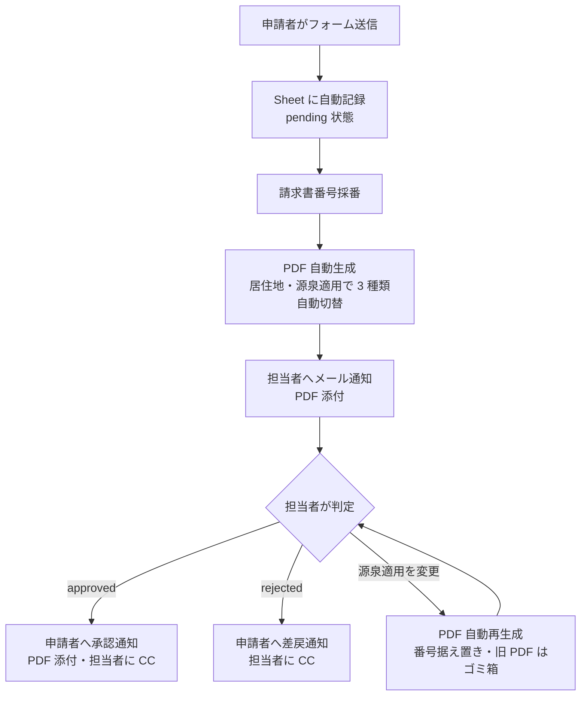

# 請求書自動化システム / Invoice Automation System

> 申請者から請求書発行依頼を受け付け、PDF を自動生成・自動送信する Google Apps Script ベースのシステム
>
> A Google Apps Script-based system that accepts invoice requests, auto-generates PDF invoices, and handles the approval/notification workflow.

[](https://opensource.org/licenses/MIT)
[](https://script.google.com/)
[](#)

[**日本語**](#日本語) ・ [**English**](#english)

---

## 日本語

### 📌 概要

外注先・フリーランスからの請求書発行を全自動化するシステムです。

- **申請者**は多言語フォーム（日本語 / English / 繁體中文 / Español）に入力して送信するだけ
- **担当者**はメールを受け取り、シート上で「承認」または「差戻」を選ぶだけ
- **PDF 生成、番号採番、税計算、通知メール送信、Drive 保存**はすべて自動

Google Workspace の標準機能だけで完結し、外部サービス・サーバー・データベースは不要です。

### ✨ 主な機能

- 🌐 **多言語対応フォーム**（日本語 / English / 繁體中文 / Español・URL パラメータで切替可）
- 📄 **3 種類の PDF テンプレート自動切替**（海外居住者 / 国内・源泉なし / 国内・源泉あり）
- 🔢 **月別連番採番**（例: `202605-001`）
- 💴 **多通貨対応**（JPY / TWD / USD / EUR、必要なら拡張可能）
- 🧮 **税計算の自動化**（消費税 10%、源泉所得税 10.21% / 20.42%、100万円基準）
- 📧 **3 種類の自動メール**:
  - 申請受付時 → 担当者へ PDF 添付通知
  - 承認時 → 申請者へ承認通知（PDF 添付 + 担当者に CC）
  - 差戻時 → 申請者へ差戻通知（担当者に CC）
- ✏️ **メール文面はシートで編集可能**（{{INVOICE_NO}} / {{APPLICANT_NAME}} placeholder 対応）
- 🧾 **インボイス制度対応**（適格請求書発行事業者登録番号の表示/非表示を選択可能）
- 🔁 **源泉適用の後付け対応**（シートで yes に変更すると PDF を自動再生成）
- 📂 **PDF は Drive フォルダに自動保存**（税理士・会計事務所への一括共有が容易）

### 🏗 ファイル構成

| ファイル | 用途 |
|---|---|
| `appsscript.json` | Apps Script マニフェスト（権限・タイムゾーン）|
| `Setup.gs` | 初期セットアップ・マイグレーション・使い方シート生成 |
| `Code.gs` | フォーム受付・PDF 生成・メール送信・トリガー処理 |
| `index.html` | 申請者用 Web フォーム |
| `style.html` | フォームの CSS（RWD 対応）|
| `script.html` | フォームの JavaScript |
| `i18n.html` | 多言語翻訳辞書（日本語 / English / 繁體中文 / Español）|

### 🔧 必要なもの

- Google アカウント（個人またはWorkspace）
- ブラウザ（Apps Script を編集する人）
- メール受信できるアドレス 1 件以上（通知先 / テスト用）

### 🚀 セットアップ手順

<details>
<summary><b>📦 方法 A: 手動コピペ（GAS 初心者向け、約 20 分）</b></summary>

#### Step 1. Apps Script プロジェクト作成

1. [Google Apps Script](https://script.google.com/) にアクセス
2. 「**新しいプロジェクト**」をクリック
3. プロジェクト名を「**請求書システム**」など任意の名前に変更

#### Step 2. ファイルを 7 つコピー

Apps Script エディタで、本リポジトリの以下のファイルを 1:1 でコピー＆ペースト：

| ローカル | Apps Script |
|---|---|
| `appsscript.json` | `appsscript.json`（プロジェクト設定で「マニフェスト ファイルを表示」を有効化）|
| `Setup.gs` | 新規ファイル「Setup」 |
| `Code.gs` | `コード.gs` を全選択して上書き |
| `index.html` | 新規 HTML ファイル「index」 |
| `style.html` | 新規 HTML ファイル「style」 |
| `script.html` | 新規 HTML ファイル「script」 |
| `i18n.html` | 新規 HTML ファイル「i18n」 |

#### Step 3. 初期セットアップを実行（1 関数で完了）

> 💡 **おすすめ：** 関数ドロップダウンから **`setup`** を選択 →「**実行**」するだけで、下記 Step 3〜4（Sheet 作成・トリガー配線・使い方シート生成）が**正しい順序で一括実行**されます（冪等・再実行可）。初回は権限承認が必要（Drive / Sheet / Mail / Trigger 等のスコープ）。完了後は Step 5 へ。

個別に実行したい場合のみ、順番に：

1. `runSetup` → **Sheet が自動作成**され、スクリプトプロパティに `SPREADSHEET_ID` が保存される
2. `installSheetMenuTrigger` → カスタムメニュー有効化
3. `installStatusEditTrigger` → 承認/差戻/源泉適用変更の自動通知 trigger
4. `populateUsageSheet` → 「使い方」シート自動生成

#### Step 5. 「設定」シートに会社情報を入力

作成されたスプレッドシートの「設定」タブを開き、各項目を埋める（[設定項目](#-設定項目) 参照）。

特に **`notification_email`（管理者の通知先）** は必須。

#### Step 6. Web App としてデプロイ

1. Apps Script で「**デプロイ → 新しいデプロイ**」
2. 種類: **ウェブアプリ**
3. 設定:
   - 説明: 「初版」など
   - 次のユーザーとして実行: **自分**
   - アクセスできるユーザー: **全員**
4. **ウェブアプリ URL（/exec 形式）をコピー**

#### Step 7. デプロイ URL を「設定」に保存

「設定」シートの `form_url` 行に Step 6 でコピーした URL を貼り付ける。

#### Step 8. 「使い方」シートを再生成

`populateUsageSheet` を再実行 → URL が反映された使い方ガイドが完成。

#### Step 9. 申請者にフォーム URL を共有

完了 🎉

</details>

<details>
<summary><b>⚡ 方法 B: clasp で自動 push（dev 慣れた人向け、約 5 分）</b></summary>

```bash
# clasp インストール（初回のみ）
npm install -g @google/clasp
clasp login

# 本リポジトリを clone
git clone https://github.com/CVERInc/seikyusho.git
cd seikyusho

# 新しい Apps Script プロジェクト作成 & push
clasp create --type standalone --title "請求書システム"
clasp push -f

# Apps Script で setup() を1回実行（Step 3〜4 を一括）
# 設定入力 → デプロイ → form_url 保存 → populateUsageSheet 再実行
```

</details>

### ⚙️ 設定項目

「設定」シートで管理する項目一覧:

| key | 必須 | 内容 |
|---|---|---|
| `company_name_ja-JP` | ✅ | 請求書宛先（日本語表記）|
| `company_name_en-US` | | 請求書宛先（英語表記）|
| `company_name_zh-TW` | | 請求書宛先（台湾華語・繁体字表記）|
| `company_name_es-ES` | | 請求書宛先（スペイン語表記）|
| `company_address` | ✅ | 本店所在地 |
| `corporate_number` | | 法人番号（13桁、表示する場合のみ）|
| `representative` | | 代表者名 |
| `notification_email` | ✅ | 担当者の通知先メールアドレス |
| `form_url` | | デプロイ後の Web App URL（/exec 形式）|
| `qualified_invoice_number` | | 適格請求書発行事業者登録番号（T+13桁、未登録なら空欄）|
| `show_corporate_number` | | PDF に法人番号を表示（yes/no、デフォルト no）|
| `email_subject_approved` | | 承認時の件名（{{INVOICE_NO}} 等の placeholder 可）|
| `email_body_approved` | | 承認時の本文 |
| `email_subject_rejected` | | 差戻時の件名 |
| `email_body_rejected` | | 差戻時の本文 |
| `consumption_tax_rate` | | 消費税率（デフォルト 0.10）|
| `withholding_tax_rate` | | 源泉税率（デフォルト 0.1021）|
| `withholding_threshold` | | 源泉税率切替基準額（デフォルト 1000000）|
| `withholding_tax_rate_over` | | 上限超過時の源泉税率（デフォルト 0.2042）|
| `pdf_folder_id` | | PDF 保存先 Drive フォルダ ID（自動作成される）|

### 📊 運用フロー



### ❓ よくある質問

<details>
<summary>Q1. Apps Script のクォータに引っかかりませんか？</summary>

通常規模の運用（月数十～数百件）であれば問題ありません。Google Workspace アカウントの場合、メール送信は **1500 通/日**、Drive 操作は実質無制限です。

</details>

<details>
<summary>Q2. PDF テンプレートのレイアウトを変えたい</summary>

`TPL_海外` / `TPL_源泉あり` / `TPL_源泉なし` シートで直接編集できます。

ヘッダー（「品名」「数量」「単価」「金額」「小計」）の位置・列・行は自動検出されるので、自由にレイアウトを変更できます。

`{{APPLICANT_NAME}}` `{{INVOICE_NO}}` 等の placeholder を保持していれば動作します。

</details>

<details>
<summary>Q3. メール文面を変えたい</summary>

「設定」シートの `email_subject_approved` / `email_body_approved` / `email_subject_rejected` / `email_body_rejected` を編集すれば即反映されます。

複数行の本文も `Cmd/Ctrl+Enter` で改行を入力できます。

</details>

<details>
<summary>Q4. インボイス制度に対応していますか？</summary>

はい。`qualified_invoice_number` に登録番号（T+13桁）を入力すると、PDF 下部に「登録番号: T...」が表示されます。

未登録の場合は `show_corporate_number` を `no` のまま（デフォルト）にしておけば、誤解を招く表記は一切出ません。

</details>

<details>
<summary>Q5. テストデータを一括削除したい</summary>

スプレッドシートのメニュー「請求書 → ❌ 全テストデータ削除」で、申請データ・番号管理・Drive PDF が一括クリアされます（確認ダイアログあり）。

</details>

### 🤝 貢献

Issue や Pull Request 歓迎します。詳しい貢献ガイドは [**CONTRIBUTING.md**](./CONTRIBUTING.md) を参照してください。

- 🐛 バグ報告 → 再現手順を添えて Issue
- 💡 機能提案 → Discussions または Issue
- 🌐 翻訳追加 → [新言語追加ガイド](./CONTRIBUTING.md#-新言語の追加方法)（8 ステップで完了）
- 💴 新通貨対応 → [新通貨追加ガイド](./CONTRIBUTING.md#-新通貨の追加方法)

### 📜 ライセンス

[MIT License](./LICENSE)

---

## English

### 📌 Overview

A fully automated invoice issuance system for accepting requests from contractors, freelancers, or any external party.

- **Applicants** simply fill out a multilingual form (Japanese / English / Traditional Chinese / Spanish)
- **Administrators** receive an email, then click "Approve" or "Reject" on the sheet
- **PDF generation, numbering, tax calculation, email notifications, and Drive archiving** are all automatic

Built entirely on Google Workspace — no external services, servers, or databases required.

### ✨ Features

- 🌐 **Multilingual form** (Japanese / English / Traditional Chinese / Spanish, switchable via URL param)
- 📄 **3 PDF templates auto-selected** (overseas resident / Japan w/o withholding / Japan with withholding)
- 🔢 **Monthly sequential invoice numbering** (e.g., `202605-001`)
- 💴 **Multi-currency** (JPY / TWD / USD / EUR, extensible)
- 🧮 **Automatic tax calculation** (10% consumption tax, 10.21% / 20.42% withholding tax with 1M JPY threshold)
- 📧 **3 types of automated emails**:
  - On submission → admin receives notification with PDF attached
  - On approval → applicant receives approval notice (PDF attached, admin CC'd)
  - On rejection → applicant receives rejection notice (admin CC'd)
- ✏️ **Email content editable from sheet** ({{INVOICE_NO}} / {{APPLICANT_NAME}} placeholders supported)
- 🧾 **Japanese Qualified Invoice System (Invoice Seido) support** (toggle registration number display)
- 🔁 **Withholding tax can be added post-submission** (changing the sheet auto-regenerates the PDF)
- 📂 **PDFs auto-saved to a Drive folder** (easy bulk sharing with accountants)

### 🏗 File Structure

| File | Purpose |
|---|---|
| `appsscript.json` | Apps Script manifest (permissions, timezone) |
| `Setup.gs` | Initial setup, migrations, usage sheet generation |
| `Code.gs` | Form handler, PDF generation, mail sender, triggers |
| `index.html` | Applicant-facing web form |
| `style.html` | Form CSS (responsive) |
| `script.html` | Form JavaScript |
| `i18n.html` | Translation dictionary (日本語 / English / 繁體中文 / Español) |

### 🔧 Prerequisites

- Google account (personal or Workspace)
- A browser (for the admin who sets it up)
- At least one email address to receive notifications

### 🚀 Setup

<details>
<summary><b>📦 Option A: Manual copy/paste (~20 min)</b></summary>

#### Step 1. Create Apps Script project

1. Open [Google Apps Script](https://script.google.com/)
2. Click "**New project**"
3. Rename it (e.g., "Invoice System")

#### Step 2. Copy 7 files

Copy each file from this repo into the Apps Script editor (1:1):

| Local | Apps Script |
|---|---|
| `appsscript.json` | `appsscript.json` (enable "Show appsscript.json" in settings) |
| `Setup.gs` | New file "Setup" |
| `Code.gs` | Overwrite the default `Code.gs` |
| `index.html` | New HTML file "index" |
| `style.html` | New HTML file "style" |
| `script.html` | New HTML file "script" |
| `i18n.html` | New HTML file "i18n" |

#### Step 3. Run initial setup (one function does it all)

> 💡 **Recommended:** Select **`setup`** from the function dropdown → **Run**. It runs Steps 3–4 below (create sheet, wire triggers, generate the usage sheet) **in the right order**, idempotently. Grant permissions on first run (Drive / Sheet / Mail / Trigger scopes), then skip to Step 5.

Only if you prefer to run them individually:

1. `runSetup` — a spreadsheet is auto-created and `SPREADSHEET_ID` is saved to script properties
2. `installSheetMenuTrigger` — enables the custom menu
3. `installStatusEditTrigger` — wires approval/rejection/withholding-change auto-handlers
4. `populateUsageSheet` — generates the "Usage" sheet

#### Step 5. Fill in company info in the "設定" (Settings) sheet

Open the spreadsheet, navigate to the **設定 (Settings)** tab, and fill in fields (see [Configuration](#%EF%B8%8F-configuration)).

`notification_email` (admin's address) is **required**.

#### Step 6. Deploy as Web App

1. In Apps Script: **Deploy → New deployment**
2. Type: **Web app**
3. Settings:
   - Execute as: **Me**
   - Who has access: **Anyone**
4. **Copy the web app URL** (ends in `/exec`)

#### Step 7. Paste the URL into "設定"

Set `form_url` to the URL from Step 6.

#### Step 8. Regenerate the usage sheet

Run `populateUsageSheet` again — the URL will now appear in the guide.

#### Step 9. Share the form URL with applicants

Done 🎉

</details>

<details>
<summary><b>⚡ Option B: Push via clasp (~5 min)</b></summary>

```bash
# Install clasp once
npm install -g @google/clasp
clasp login

# Clone & push
git clone https://github.com/CVERInc/seikyusho.git
cd seikyusho

clasp create --type standalone --title "Invoice System"
clasp push -f

# Then run setup() once in Apps Script (Steps 3–4), fill Settings, deploy as web app
```

</details>

### ⚙️ Configuration

Edit these in the **設定 (Settings)** sheet:

| key | Required | Description |
|---|---|---|
| `company_name_ja-JP` | ✅ | Recipient name (Japanese) |
| `company_name_en-US` | | Recipient name (English) |
| `company_name_zh-TW` | | Recipient name (Traditional Chinese / Taiwan) |
| `company_name_es-ES` | | Recipient name (Spanish) |
| `company_address` | ✅ | Registered address |
| `corporate_number` | | Corporate number (13 digits, only if shown) |
| `representative` | | Representative name |
| `notification_email` | ✅ | Admin's notification email |
| `form_url` | | Deployed web app URL (after deployment) |
| `qualified_invoice_number` | | Qualified invoice issuer number (T + 13 digits) |
| `show_corporate_number` | | Show corporate number on PDF (yes/no, default no) |
| `email_subject_approved` | | Subject for approval mail |
| `email_body_approved` | | Body for approval mail |
| `email_subject_rejected` | | Subject for rejection mail |
| `email_body_rejected` | | Body for rejection mail |
| `consumption_tax_rate` | | Consumption tax rate (default 0.10) |
| `withholding_tax_rate` | | Withholding tax rate (default 0.1021) |
| `withholding_threshold` | | Withholding tax threshold (default 1,000,000 JPY) |
| `withholding_tax_rate_over` | | Withholding rate above threshold (default 0.2042) |
| `pdf_folder_id` | | Drive folder ID for PDFs (auto-created) |

### 📊 Workflow

See the Mermaid diagram in the [日本語 section](#-運用フロー) — same flow, labels are Japanese in the diagram.

In short: Applicant submits → Sheet logs as `pending` → PDF generated → Admin notified → Admin sets `approved` or `rejected` on sheet → Applicant gets corresponding email automatically.

### ❓ FAQ

<details>
<summary>Q1. Will I hit Apps Script quotas?</summary>

For typical usage (tens to hundreds per month), no. Workspace accounts allow **1,500 emails/day** and Drive ops are effectively unlimited.

</details>

<details>
<summary>Q2. How do I change the PDF template layout?</summary>

Edit the `TPL_海外` / `TPL_源泉あり` / `TPL_源泉なし` sheets directly.

Header positions (品名/数量/単価/金額/小計) are auto-detected, so you can move them freely.

Keep the `{{APPLICANT_NAME}}`, `{{INVOICE_NO}}`, etc. placeholders intact.

</details>

<details>
<summary>Q3. How do I customize email text?</summary>

Edit `email_subject_approved` / `email_body_approved` / `email_subject_rejected` / `email_body_rejected` in the Settings sheet. Changes apply immediately.

Use `Cmd/Ctrl+Enter` to insert line breaks within a cell.

</details>

<details>
<summary>Q4. Does it support the Japanese Qualified Invoice System (Invoice Seido)?</summary>

Yes. Fill `qualified_invoice_number` (T + 13 digits) and your PDF will show "登録番号: T..." at the bottom.

If you're not registered, leave `show_corporate_number` as `no` (the default) — no misleading numbers will appear.

</details>

<details>
<summary>Q5. How do I clean up test data?</summary>

In the spreadsheet menu: **請求書 → ❌ 全テストデータ削除**. Submissions, counter, and Drive PDFs are cleared in one shot (with confirmation).

</details>

### 🤝 Contributing

Issues and PRs welcome. See [**CONTRIBUTING.md**](./CONTRIBUTING.md) for the full guide.

- 🐛 Bug reports → include reproduction steps
- 💡 Feature requests → Discussions or Issues
- 🌐 Translations → [Adding a new language guide](./CONTRIBUTING.md#-adding-a-new-language) (8 steps)
- 💴 New currency → [Adding a new currency guide](./CONTRIBUTING.md#-adding-a-new-currency)

### 📜 License

[MIT License](./LICENSE)

---

Built with ❤️ on Google Apps Script
